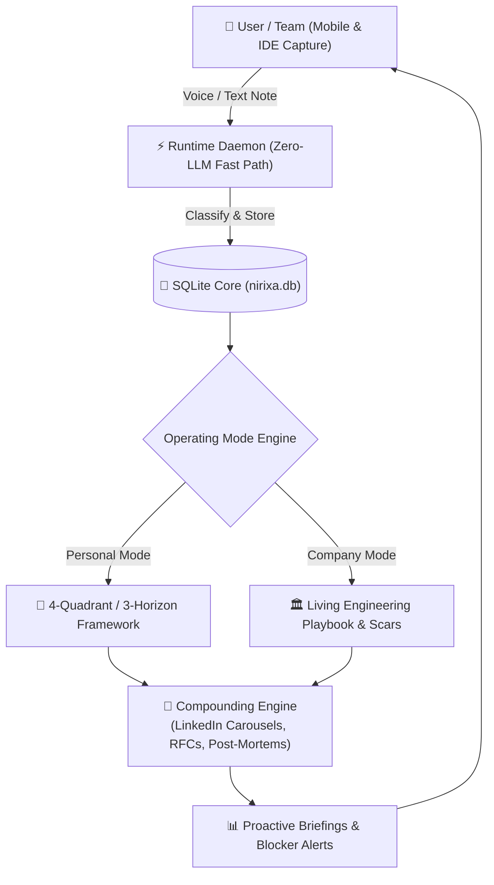

# Nirixa OS (My-OS)

> **A 24/7 AI Chief of Staff & Company Living Wiki for high-leverage builders, engineers, and teams.**

```
                       🎯 MISSION
               (Career, Products, Outputs)
                           │
                           │
       🧘 MIND ────────────┼──────────── 🧠 MASTERY
 (Health, Clarity, Energy) │        (Deep Inquiry, Knowledge)
                           │
                           │
                       💰 MONEY
             (Freedom, Capital, Equity)
```

Traditional note-taking and productivity apps (Notion, Todoist, Confluence) fail because they are static databases where ideas and engineering lessons go to die.

**Nirixa OS** turns your mobile phone and IDE into an active, 24/7 intelligence gateway. Whether you are an individual scaling your career or an engineering team capturing production scars, Nirixa OS actively spars with your thoughts, tracks your goals, and auto-compiles your lessons into living playbooks and assets.

---

## ⚡ Universal AI Agent Onboarding

When you clone Nirixa OS and open it in **Antigravity**, **Cursor**, **Claude Code**, or **Windsurf**, your coding agent immediately guides you through a **3-minute interactive setup interview**:

```text
👋 Welcome to Nirixa OS! I am your AI Operating Agent.

Let's set up your system in under 3 minutes. Are you configuring this for:
1. 👤 Personal Chief of Staff (Life Goals, Socratic Thinking, Career, Mobile Capture)
2. 🏛️ Company Living Wiki & Playbook (Engineering Standards, Post-Mortem Scars, Async Standups)
3. 🛠️ Custom Hybrid Setup
```

---

## 🧭 Dual-Mode Architecture

### **Mode A: Personal Chief of Staff**
* 🧭 **4-Quadrant Compass**: Balance across *Mission, Mastery, Money, Mind*. ([`docs/PERSONAL_COMPASS.md`](docs/PERSONAL_COMPASS.md))
* 🌟 **3-Horizon Engine**: High-velocity sprints connecting *North Star ➔ Friction Radar ➔ Weekly Top 3*. ([`docs/HORIZON_ENGINE.md`](docs/HORIZON_ENGINE.md))
* 👤 **Monish's Living Blueprint**: Complete 24-hour walkthrough of how Monish runs it at EY. ([`docs/MONISH_CASE_STUDY.md`](docs/MONISH_CASE_STUDY.md))

### **Mode B: Company Living Wiki & Engineering Playbook**
* 🏛️ **Living Engineering Playbook**: Standards, PR review invariants, and architecture guardrails. ([`docs/company/ENGINEERING_PLAYBOOK.md`](docs/company/ENGINEERING_PLAYBOOK.md))
* 🩹 **Post-Mortem Scars Vault**: Turn production outages into permanent algorithmic rules. ([`docs/company/POST_MORTEMS_AND_SCARS.md`](docs/company/POST_MORTEMS_AND_SCARS.md))
* 🤖 **Async Standup & Blocker Radar**: Automate daily team dependency tracking. ([`docs/company/README.md`](docs/company/README.md))

---

## 🌿 The Progressive Enlightenment Model

You do not need to understand complex architecture on Day 1. Nirixa OS guides you through a gradual 30-day cognitive journey:

* 🌱 **Day 1 (Utility)**: 2-Min Telegram connect. Send text/voice notes, get instant reminders, status, and briefings.
* 🌿 **Day 7 (Reflection)**: AI surfaces recurring weekly friction and conducts your first Socratic sparring session.
* 🌳 **Day 30+ (Compounding)**: Auto-compiles your monthly scars into ready-to-upload LinkedIn PDF carousels and teaches you to build custom agent skills.
* 👉 **[Read the Full Progressive Enlightenment Model](docs/PROGRESSIVE_ENLIGHTENMENT.md)**

---

## ⚡ 5-Minute Quickstart

1. **Clone & Open in Your Favorite IDE**:
   ```bash
   git clone https://github.com/Monish-Nallagondalla/My-Os.git
   cd My-Os
   ```
2. **Let Your AI Agent Run the Setup Interview**:
   * Open the workspace in Antigravity, Cursor, or Claude Code.
   * Type: `"Set up my OS"` or `"Onboard me"`.
3. **Connect Your Private Telegram Bot**:
   * Paste your `TELEGRAM_BOT_TOKEN` and `TELEGRAM_CHAT_ID` into `system/config/.env`.
4. **Start the Background Listener**:
   ```bash
   python system/scripts/telegram_listener.py
   ```

👉 **[Detailed Step-by-Step Onboarding Guide](docs/ONBOARDING.md)**

---

## 🛠️ System Architecture & Under the Hood



* **Zero-LLM Fast Path**: Telemetry, reminders, and daily briefings run deterministically at 0 token cost.
* **DB-First Memory Core**: Single SQLite database (`system/data/nirixa.db`) + vector search. Zero file clutter.
* **Proactive Socratic Sparring**: The AI actively challenges assumptions and extracts authentic scars instead of flattering or autocompleting.

---

## 📜 Documentation Index

* 🧭 [The Personal Operating Compass](docs/PERSONAL_COMPASS.md) — 4-Quadrant holistic balance model.
* 🌟 [The 3-Horizon Life Engine](docs/HORIZON_ENGINE.md) — 3-Horizon sprint execution model.
* 🏛️ [Company Living Wiki Hub](docs/company/README.md) — Enterprise & team operating system.
* 👤 [Monish's Real-World Case Study](docs/MONISH_CASE_STUDY.md) — 24-hour operating blueprint.
* 🌿 [The Progressive Enlightenment Model](docs/PROGRESSIVE_ENLIGHTENMENT.md) — 30-day cognitive adoption ladder.
* 🚀 [Quickstart Onboarding Guide](docs/ONBOARDING.md) — 5-minute setup instructions.
* 🛠️ [CLI & System Playbook](docs/PLAYBOOK.md) — Technical commands and scripts reference.

---

## 📄 License
MIT License. Built with first-principles clarity by Monish Nallagondalla.