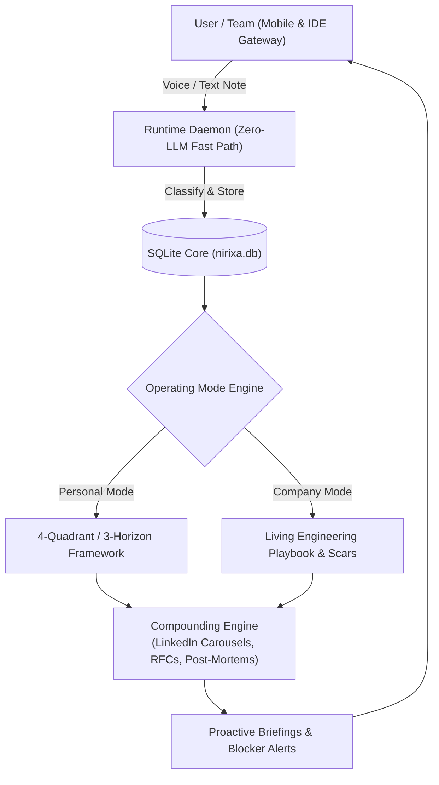

# Nirixa OS ☤
<p align="center">
  <a href="https://github.com/Monish-Nallagondalla/My-Os">Nirixa OS</a> | <a href="docs/ONBOARDING.md">Getting Started</a> | <a href="docs/MONISH_CASE_STUDY.md">Living Blueprint</a>
</p>
<p align="center">
  <a href="docs/ONBOARDING.md"></a>
  <a href="https://github.com/Monish-Nallagondalla/My-Os/blob/main/LICENSE"></a>
  
  
  
  
</p>

**The autonomous 24/7 AI Chief of Staff and Company Living Wiki built by Monish Nallagondalla.** It is an agentic operating system with a closed learning loop — it captures raw voice and text friction on mobile, debates and spars on assumptions via Socratic reasoning, persists structured knowledge in an ACID SQLite core, and auto-compiles authentic lessons into living engineering playbooks, keynote abstracts, and career assets. Run it locally, on an Oracle Always-Free VPS, or alongside your coding agent in Google Antigravity, Cursor, and Claude Code. It is not tied to your IDE — talk to it from Telegram while it manages your memory, telemetry, and execution.

Use any model you want — Gemini Flash, Claude, OpenAI, or local open weights. Switch via configuration with zero code changes and zero lock-in.

<table>
<tr><td width="30%"><b>A real mobile and terminal gateway</b></td><td>Zero-friction Telegram text and voice capture, interactive inline buttons, 1-click approvals, and bidirectional IDE execution with zero latency.</td></tr>
<tr><td><b>Dual operating modes</b></td><td><b>Mode A (Personal Chief of Staff)</b>: 4-Quadrant Compass (Mission, Mastery, Money, Mind) and 3-Horizon Execution Engine.<br/><b>Mode B (Company Living Wiki)</b>: Living Engineering Playbook, Post-Mortem Scars Vault, and automated async standup dependency radar.</td></tr>
<tr><td><b>A closed Socratic learning loop</b></td><td>The AI does not flatter or autocomplete. It probes unstated premises, extracts authentic architectural scars, and evolves living Original Thought Assets (OTAs) that compound over decades.</td></tr>
<tr><td><b>Zero-LLM deterministic fast path</b></td><td>Hardware telemetry, regex reminders, time-wheel briefings, and status checks run 100% deterministically at zero token cost.</td></tr>
<tr><td><b>DB-first SQLite memory core</b></td><td>Single ACID SQLite database (<code>system/data/nirixa.db</code>) with vector embeddings (sqlite-vec) and FTS5 search. Zero unorganized markdown file proliferation. Full thought ancestry and lineage tracking.</td></tr>
<tr><td><b>Universal coding agent onboarding</b></td><td>Interactive Inform -&gt; Confirm -&gt; Build interview protocol across Google Antigravity, Cursor (<code>.cursorrules</code>), and Claude Code (<code>CLAUDE.md</code>).</td></tr>
<tr><td><b>Progressive enlightenment ladder</b></td><td>30-Day cognitive adoption curve: Day 1 (Zero-effort mobile utility) -&gt; Day 7 (Socratic reflection and pattern detection) -&gt; Day 30 (Custom agent skills and self-evolving playbooks).</td></tr>
</table>

---

## Quick Install

### Linux, macOS, WSL2

```bash
git clone https://github.com/Monish-Nallagondalla/My-Os.git
cd My-Os
cp system/config/.env.example system/config/.env
pip install -r requirements.txt
```

### Windows (PowerShell)

```powershell
git clone https://github.com/Monish-Nallagondalla/My-Os.git
cd My-Os
Copy-Item system/config/.env.example system/config/.env
pip install -r requirements.txt
```

### Connecting Your Telegram Gateway (2 Minutes)

1. Open Telegram, search for `@BotFather`, send `/newbot`, and copy your **API Token**.
2. Search for `@userinfobot`, click Start, and copy your numerical **Chat ID**.
3. Add both to `system/config/.env`:
   ```env
   TELEGRAM_BOT_TOKEN=your_bot_token_here
   TELEGRAM_CHAT_ID=your_chat_id_here
   ```
4. Start the listener:
   ```bash
   python system/scripts/telegram_listener.py
   ```

---

## Getting Started

```bash
python system/scripts/telegram_listener.py   # Start real-time background mobile listener
python system/scripts/send_status.py         # Dispatch live hardware & OS telemetry dashboard
python system/scripts/sync.py                # Sync mobile inbox & run 7-day chat cleanup
python system/engine/evolver.py             # Run self-evolution audit on feedback ratios
python system/engine/evals/run_system_evals.py # Run deterministic system evaluation suite
```

Full documentation is available in the [Documentation Hub](#documentation).

---

## Universal Coding Agent Integration

When you clone Nirixa OS and open it in your preferred IDE, your coding agent immediately guides you through the 3-minute setup interview:

* **Google Antigravity**: Automatically loads `.agents/skills/user-onboarding/` and workspace rules.
* **Cursor**: Automatically reads `.cursorrules`.
* **Claude Code**: Automatically reads `CLAUDE.md`.

Simply ask your agent:
> *"Set up my OS"* or *"Onboard me"*

---

## CLI vs Messaging Quick Reference

Nirixa OS operates across two synchronized interfaces: the local IDE/CLI runtime and the Telegram mobile gateway.

| Action | Local CLI / IDE | Telegram Mobile Gateway |
| :--- | :--- | :--- |
| Capture thought or friction | Save to `inbox/` or speak in IDE chat | Send text or 10-second voice note |
| Hardware & DB telemetry | `python system/scripts/send_status.py` | Tap `[ System Status ]` button |
| Socratic sparring | Interactive chat pairing in Antigravity | Real-time Socratic thesis pushback |
| Check reminders | Query `reminders` table in `nirixa.db` | Tap `[ Check Reminders ]` button |
| Put laptop to sleep | Trigger sleep script | Tap `[ Put Laptop to Sleep ]` button |
| Compile public assets | Run publisher script | Tap `[ Auto-Compile Assets ]` button |

---

## Dual Operating Frameworks

```
┌───────────────────────────────────────────────┬───────────────────────────────────────────────┐
│     MODE A: PERSONAL CHIEF OF STAFF           │     MODE B: COMPANY LIVING WIKI & PLAYBOOK    │
├───────────────────────────────────────────────┼───────────────────────────────────────────────┤
│ - Mission (Career, Products, Outputs)         │ - Company Vision, Values & Strategic Moat     │
│ - Mastery (Deep Inquiry, Books, Research)     │ - Living Engineering Standards & PR Rules     │
│ - Money (Revenue, Assets, Freedom)            │ - Post-Mortem Scars Vault (Outage Invariants) │
│ - Mind (Health, Clarity, Vitality)            │ - Async Standup & Dependency Blocker Radar    │
│                                               │                                               │
│ [docs/PERSONAL_COMPASS.md]                    │ [docs/company/README.md]                      │
└───────────────────────────────────────────────┴───────────────────────────────────────────────┘
```

---

## Living Case Study: How Monish Uses It Daily

A complete 24-hour walkthrough of how Monish runs Nirixa OS as an AI Product Leader at Ernst & Young (EY):
* **09:00 AM**: Deterministic Morning Executive Briefing on Telegram.
* **02:30 PM**: `[MISSION]` Voice note capture on Enterprise Multi-Agent Deadlocks (auto-anonymized and indexed).
* **06:00 PM**: `[MASTERY]` Socratic sparring on *Human Non-Determinism vs. LLM Determinism* (registered as `OTA-016`).
* **08:30 PM**: `[MIND]` Ather ride clarity and workout energy tracking.
* **Sunday Review**: 1-Click auto-compilation of scars into LinkedIn PDF Carousels and Keynote abstracts.

Full blueprint: **[docs/MONISH_CASE_STUDY.md](docs/MONISH_CASE_STUDY.md)**

---

## Progressive Enlightenment Model

You do not need to understand complex architecture on Day 1. Nirixa OS guides you through a 30-day cognitive adoption journey:

```
  ┌─────────────────────────┐
  │   DAY 1: UTILITY        │  -> 2-Min Telegram setup. Send voice notes, get reminders & briefings.
  └───────────┬─────────────┘
              │
              ▼
  ┌─────────────────────────┐
  │   DAY 7: REFLECTION     │  -> AI surfaces recurring friction. First Socratic sparring on phone.
  └───────────┬─────────────┘
              │
              ▼
  ┌─────────────────────────┐
  │   DAY 30: COMPOUNDING   │  -> Auto-compiles public assets/playbooks. Teaches custom skills.
  └─────────────────────────┘
```

Full details: **[docs/PROGRESSIVE_ENLIGHTENMENT.md](docs/PROGRESSIVE_ENLIGHTENMENT.md)**

---

## Architecture



---

## Documentation

| Section | What is Covered |
| :--- | :--- |
| [Quickstart](docs/ONBOARDING.md) | Install -> setup -> first mobile capture in 2 minutes |
| [Personal Compass](docs/PERSONAL_COMPASS.md) | 4-Quadrant holistic balance model (Mission, Mastery, Money, Mind) |
| [3-Horizon Engine](docs/HORIZON_ENGINE.md) | 3-Horizon execution framework (North Star -> Friction -> Sprint) |
| [Company Living Wiki](docs/company/README.md) | Team operating system, living playbooks, and async standups |
| [Engineering Playbook](docs/company/ENGINEERING_PLAYBOOK.md) | Architectural standards, PR review invariants, and test rules |
| [Post-Mortem Scars Vault](docs/company/POST_MORTEMS_AND_SCARS.md) | Production outage post-mortems converted into living algorithmic rules |
| [Living Case Study](docs/MONISH_CASE_STUDY.md) | 24-Hour operating blueprint of Monish's daily workflow at EY |
| [Progressive Enlightenment](docs/PROGRESSIVE_ENLIGHTENMENT.md) | 30-Day cognitive adoption ladder |
| [Original Thought Assets](docs/VISION.md) | The Question Project, thought lineage, and epistemological foundation |
| [CLI Playbook](docs/PLAYBOOK.md) | Complete CLI scripts and technical reference |

---

## License

MIT — see [LICENSE](LICENSE).

Built with first-principles clarity by [Monish Nallagondalla](https://github.com/Monish-Nallagondalla).