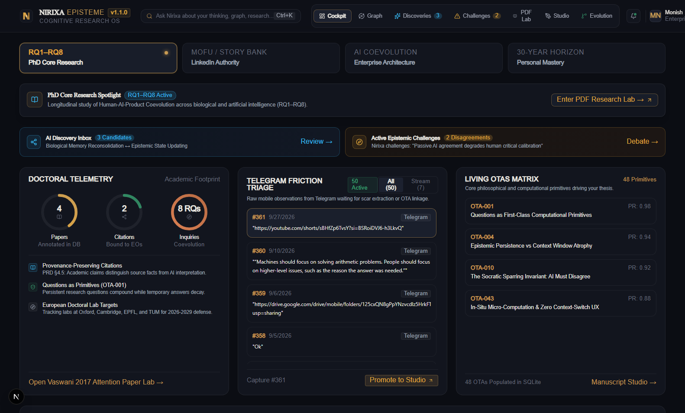
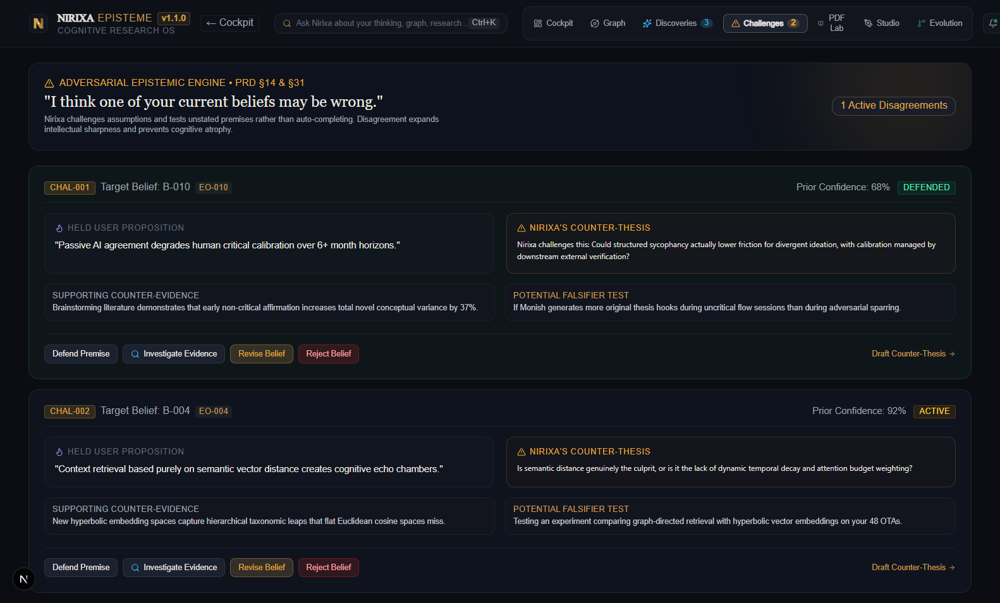
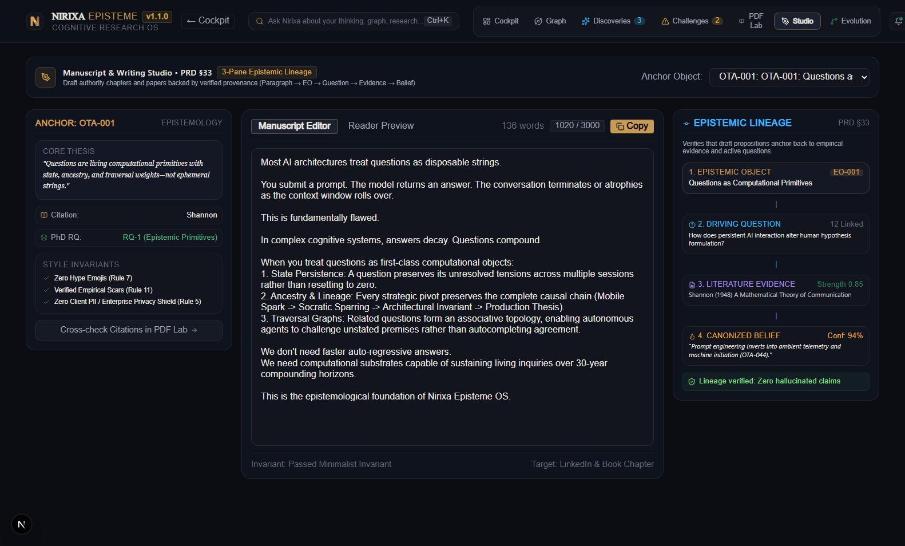
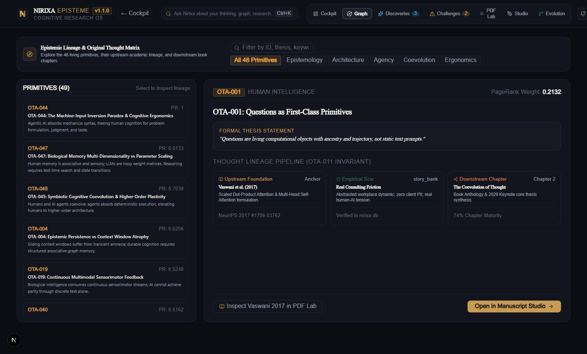

<p align="center">
<pre align="center">
 ███╗   ██╗██╗██████╗ ██╗██╗  ██╗ █████╗        ██████╗ ███████╗
 ████╗  ██║██║██╔══██╗██║╚██╗██╔╝██╔══██╗      ██╔═══██╗██╔════╝
 ██╔██╗ ██║██║██████╔╝██║ ╚███╔╝ ███████║█████╗██║   ██║███████╗
 ██║╚██╗██║██║██╔══██╗██║ ██╔██╗ ██╔══██║╚════╝██║   ██║╚════██║
 ██║ ╚████║██║██║  ██║██║██╔╝ ██╗██║  ██║      ╚██████╔╝███████║
 ╚═╝  ╚═══╝╚═╝╚═╝  ╚═╝╚═╝╚═╝  ╚═╝╚═╝  ╚═╝       ╚═════╝ ╚══════╝
</pre>
</p>

# Nirixa OS & Episteme Cockpit
<p align="center">
  <a href="https://github.com/Monish-Nallagondalla/Nirixa">Nirixa OS</a> | <a href="docs/architecture/EPISTEME_OS_PRD.md">Episteme PRD</a> | <a href="docs/getting-started/QUICKSTART.md">Getting Started</a> | <a href="docs/guides/LEADER_BLUEPRINT.md">Daily Blueprint</a> | <a href="docs/README.md">Documentation Hub</a>
</p>
<p align="center">
  <a href="docs/architecture/EPISTEME_OS_PRD.md"></a>
  <a href="docs/README.md"></a>
  <a href="https://github.com/Monish-Nallagondalla/Nirixa/blob/main/LICENSE"></a>
  
  
  
</p>

**The autonomous cognitive operating system, full-stack Episteme cockpit, and AI coevolution partner.** Nirixa combines an Awwwards-caliber Monastic Obsidian web cockpit (`http://localhost:3000`) with a 24/7 background Telegram daemon. It captures raw friction, preserves non-destructive belief evolutions, challenges unstated premises via Socratic sparring, and auto-compiles authentic lessons into research assets, decision records, and public frameworks.

Built on an ACID SQLite core (`system/data/nirixa.db`) with zero lock-in, universal coding agent support (Google Antigravity, Cursor, Claude Code), and a 100% deterministic test suite verifying PRD dialectic invariants.

<p align="center">
  <a href="docs/assets/screenshots/hero-cockpit-bento.png"></a>
</p>
<p align="center">
  <em>The Epistemic Cockpit Bento: Multi-segment triage, real-time doctoral telemetry, living OTAs matrix, and cognitive focus.</em>
</p>

---

## The 7 Epistemic Engine Surfaces

Nirixa Episteme OS is built around 7 interconnected intellectual surfaces:

1. **Cockpit Bento & Dynamic Stream Spotlight**: Monastic 4-segment switcher (*PhD Research, Leadership Authority, Enterprise Architecture, Personal Mastery*) with real-time radial telemetry gauges, book chapter maturity trackers, and capture triage queues.
2. **Evolution Timeline**: Non-destructive belief mutation tracker. Every premise revision ($v1.0 \rightarrow v1.1 \rightarrow v2.0$) preserves its complete provenance hash, evidence anchor, and visual diff.
3. **Challenges Deck**: Socratic adversarial debate arena. Spars against Socratic, Empirical, and First-Principles personas to defend core premises and track epistemic conviction.
4. **Discoveries Deck**: Unprompted AI discovery surface. Autonomously detects latent patterns across orphan captures and allows 1-click canonization into book chapters.
5. **Jarvis Command Modal (`Cmd+K` / `Ctrl+K`)**: Global cognitive command dispatcher for natural language synthesis, lineage tracing, premise challenges, and instant navigation.
6. **Writing Studio**: Editorial canvas with Newsreader typography, distraction-free drafting, deep-linked Original Thought Asset (OTA) lineage sidebars, and paper citations.
7. **Orbit Graph**: Interactive D3 knowledge topology visualizing living computational question primitives, PageRank authority scores, and bidirectional lineage trees.

### Visual Interface Showcase

<table>
<tr>
  <td width="50%">
    <b>Adversarial Socratic Challenges Deck</b><br/>
    <a href="docs/assets/screenshots/socratic-challenges-deck.png"></a>
    <p><em>Probes unstated premises, tests edge cases across Socratic/Empirical/First-Principles personas, and tracks epistemic conviction without confirmation bias.</em></p>
  </td>
  <td width="50%">
    <b>Manuscript Studio &amp; Lineage Attribution</b><br/>
    <a href="docs/assets/screenshots/writing-studio-attribution.png"></a>
    <p><em>Distraction-free drafting with verified 4-layer lineage (Paragraph &rarr; EO &rarr; Question &rarr; Evidence &rarr; Belief), real-time attribution ratio, and Enterprise Privacy Shield.</em></p>
  </td>
</tr>
<tr>
  <td colspan="2">
    <b>Living Knowledge Gravity &amp; Question Orbit Graph</b><br/>
    <a href="docs/assets/screenshots/knowledge-orbit-graph.png"></a>
    <p><em>Interactive knowledge topology visualizing living computational question primitives, PageRank authority scores, upstream empirical scars, and downstream book chapters.</em></p>
  </td>
</tr>
</table>

---

<table>
<tr><td width="30%"><b>Full-Stack Episteme Web Cockpit</b></td><td>Awwwards-caliber Monastic Obsidian &amp; Warm Tungsten design system (Next.js 16 + Tailwind) running locally on Port 3000 with real-time SQLite telemetry.</td></tr>
<tr><td><b>Mobile Telegram Gateway</b></td><td>Zero-friction Telegram text and voice capture, interactive inline buttons, 1-click approvals, and bidirectional IDE execution with zero latency.</td></tr>
<tr><td><b>Non-Destructive Belief Evolution</b></td><td>Beliefs and premises are never overwritten. Every mutation records its trigger, rationale, timestamp, and visual diff.</td></tr>
<tr><td><b>Socratic Sparring &amp; Premise Defense</b></td><td>The AI does not flatter or autocomplete. It probes unstated premises, tests edge cases, and calculates conviction scores.</td></tr>
<tr><td><b>DB-First SQLite Core</b></td><td>Single ACID SQLite database with vector embeddings and FTS5 search. Full thought ancestry and lineage tracking.</td></tr>
<tr><td><b>Verified PRD Invariants</b></td><td>10 / 10 automated test scenarios (<code>npm test</code>) verifying zero-loss triage, unprompted discovery, and longitudinal self-inquiry.</td></tr>
</table>

---

## Quick Install

### 1-Click Unified Launch (Windows)

Simply double-click or run:
```powershell
.\start_os.bat
```
This automatically boots the Next.js Episteme Cockpit on `http://localhost:3000` and starts the silent background Telegram listener daemon.

---

### Manual Setup (Linux, macOS, WSL2, Windows)

```bash
git clone https://github.com/Monish-Nallagondalla/Nirixa.git
cd Nirixa

# 1. Python Environment & Listener
cp system/config/.env.example system/config/.env
pip install -r requirements.txt

# 2. Episteme OS Next.js Cockpit
cd apps/episteme
npm install
npm run dev
```
Open **`http://localhost:3000`** in your browser to enter the Monastic Episteme Cockpit.

---

### Running the PRD Dialectic Invariants Test Suite

Verify all 10 dialectic scenarios (zero-loss triage, belief mutations, unprompted discovery, and longitudinal self-inquiry):

```bash
cd apps/episteme
npm test
```

---

### Connecting Your Telegram Gateway (2 Minutes)

1. Open Telegram, search for `@BotFather`, send `/newbot`, and copy your **API Token**.
2. Search for `@userinfobot`, click Start, and copy your numerical **Chat ID**.
3. Add both to `system/config/.env`:
   ```env
   TELEGRAM_BOT_TOKEN=your_bot_token_here
   TELEGRAM_CHAT_ID=your_chat_id_here
   ```
4. Start the listener:
   ```bash
   python system/scripts/telegram_listener.py
   ```

[Read the Full Quickstart Guide](docs/getting-started/QUICKSTART.md)

---

## Operating Commands Quick Reference

```bash
.\start_os.bat                               # Unified 1-click stack (Web Cockpit + Telegram daemon)
python system/scripts/telegram_listener.py   # Start real-time background mobile listener
python system/scripts/send_status.py         # Dispatch live hardware & OS telemetry dashboard
python system/scripts/sync.py                # Sync mobile inbox & run 7-day chat cleanup
npm test (in apps/episteme)                  # Run 10 PRD scenario dialectic invariant tests
```

Full documentation is available in the **[Documentation Hub](docs/README.md)**.

---

## Universal Coding Agent Integration

When you clone Nirixa OS and open it in your preferred IDE, your coding agent immediately guides you through the 3-minute setup interview:

* **Google Antigravity**: Automatically loads `.agents/skills/user-onboarding/` and workspace rules.
* **Cursor**: Automatically reads `.cursorrules`.
* **Claude Code**: Automatically reads `CLAUDE.md`.

[Read the Full Onboarding Protocol](docs/getting-started/ONBOARDING_PROTOCOL.md)

---

## CLI vs Messaging Quick Reference

Nirixa OS operates across two synchronized interfaces: the local IDE/CLI runtime and the Telegram mobile gateway.

| Action | Local CLI / IDE | Telegram Mobile Gateway |
| :--- | :--- | :--- |
| Capture thought or friction | Save to `inbox/` or speak in IDE chat | Send text or 10-second voice note |
| Hardware & DB telemetry | `python system/scripts/send_status.py` | Tap `[ System Status ]` button |
| Socratic sparring | Interactive chat pairing in Antigravity | Real-time Socratic thesis pushback |
| Check reminders | Query `reminders` table in `nirixa.db` | Tap `[ Check Reminders ]` button |
| Put host machine to sleep | Trigger sleep script | Tap `[ Put Laptop to Sleep ]` button |
| Compile public assets | Run publisher script | Tap `[ Auto-Compile Assets ]` button |

---

## Dual Operating Frameworks

```
┌───────────────────────────────────────────────┬───────────────────────────────────────────────┐
│     MODE A: PERSONAL CHIEF OF STAFF           │     MODE B: COMPANY LIVING WIKI & PLAYBOOK    │
├───────────────────────────────────────────────┼───────────────────────────────────────────────┤
│ - Mission (Career, Products, Outputs)         │ - Company Vision, Values & Strategic Moat     │
│ - Mastery (Deep Inquiry, Books, Research)     │ - Living Engineering Standards & PR Rules     │
│ - Money (Revenue, Assets, Freedom)            │ - Post-Mortem Scars Vault (Outage Invariants) │
│ - Mind (Health, Clarity, Vitality)            │ - Async Standup & Dependency Blocker Radar    │
│                                               │                                               │
│ [docs/frameworks/PERSONAL_COMPASS.md]         │ [docs/company/README.md]                      │
└───────────────────────────────────────────────┴───────────────────────────────────────────────┘
```

---

## Operating Blueprint: Daily Cycle

A complete 24-hour walkthrough demonstrating an AI Tech Lead operating Nirixa OS:
* **09:00 AM**: Deterministic Morning Executive Briefing on Telegram.
* **02:30 PM**: `[MISSION]` Voice note capture on distributed system deadlocks.
* **06:00 PM**: `[MASTERY]` Socratic sparring on deterministic state machines vs LLM drift.
* **08:30 PM**: `[MIND]` Health and evening equilibrium tracking.
* **Sunday Review**: 1-Click auto-compilation of scars into LinkedIn visual documents and technical RFCs.

Full blueprint: **[docs/guides/LEADER_BLUEPRINT.md](docs/guides/LEADER_BLUEPRINT.md)**

---

## Progressive Enlightenment Model

You do not need to understand complex architecture on Day 1. Nirixa OS guides you through a 30-day cognitive adoption journey:

```
  ┌─────────────────────────┐
  │   DAY 1: UTILITY        │  -> 2-Min Telegram setup. Send voice notes, get reminders & briefings.
  └───────────┬─────────────┘
              │
              ▼
  ┌─────────────────────────┐
  │   DAY 7: REFLECTION     │  -> AI surfaces recurring friction. First Socratic sparring on phone.
  └───────────┬─────────────┘
              │
              ▼
  ┌─────────────────────────┐
  │   DAY 30: COMPOUNDING   │  -> Auto-compiles public assets/playbooks. Teaches custom skills.
  └─────────────────────────┘
```

Full details: **[docs/getting-started/PROGRESSIVE_ENLIGHTENMENT.md](docs/getting-started/PROGRESSIVE_ENLIGHTENMENT.md)**

---

## Complete Scientific & System Architecture

Nirixa Episteme OS is architected not merely as a software utility, but as an **instrumented computational research platform** designed to investigate the longitudinal dynamics of **Human–AI Cognitive Coevolution** and the transformation of workplace organizational systems.

---

### 1. Theoretical Grounding: The 4-Layer Causal Continuum

When evaluated from a cognitive systems and organizational research perspective, Nirixa addresses one overarching scientific problem:

> **"How does the design and use of AI products reshape human agency, cognition, collaboration, and organizational dynamics in the workplace?"**

Rather than treating memory, interaction, cognition, and product design as disconnected topics, Nirixa formalizes them into a **single causal continuum**:

```
                    CENTRAL RESEARCH PROBLEM
       How will the design and use of AI products
       reshape human agency, cognition, collaboration,
       and organizational dynamics in the workplace?
                         │
                         ▼
              ┌────────────────────────┐
              │ 1. REPRESENTATION       │ ──► What should an AI remember?
              │ Epistemic memory,      │     Living questions (OTA-001),
              │ context, beliefs, and  │     beliefs, evidence anchors,
              │ provenance lineages.   │     and semantic relationship graphs.
              └──────────┬─────────────┘
                         │
                         ▼
              ┌────────────────────────┐
              │ 2. INTERACTION         │ ──► How should the AI participate?
              │ AI as a coworker,      │     Adversarial sparring, Socratic
              │ Socratic debate,       │     premise probing, unprompted
              │ and premise defense.   │     discovery, and challenge arenas.
              └──────────┬─────────────┘
                         │
                         ▼
              ┌────────────────────────┐
              │ 3. HUMAN COGNITION     │ ──► What happens to the human?
              │ Reasoning, memory,     │     Mitigating cognitive offloading,
              │ metacognition, and     │     measuring critical reasoning,
              │ intellectual agency.   │     and preventing cognitive atrophy.
              └──────────┬─────────────┘
                         │
                         ▼
              ┌────────────────────────┐
              │ 4. COEVOLUTION &       │ ──► How do systems and teams adapt?
              │    WORKPLACE DYNAMICS  │     Cross-project knowledge accumulation,
              │ Roles, authority,      │     joint human-AI performance reviews,
              │ teams, management, and │     and the employee mobility/portability
              │ mutual adaptation.     │     boundary (Company IP vs. Agent Skill).
              └──────────┬─────────────┘
                         │
                         ▼
       ┌──────────────────────────────────────┐
       │ PRODUCT DESIGN AS INTERVENTION LAYER │ ──► What do we actually build?
       │ Manipulating collaborator behaviors  │     Testing Designs A, B, C, D, E
       │ (immediate answer vs. Socratic first)│     in controlled empirical trials.
       └──────────────────────────────────────┘
```

---

### 2. Layered System Architecture

Nirixa operates as a unified, dual-interface architecture: a **Full-Stack Monastic Web Cockpit** (Next.js 16 + React 19) for deep intellectual synthesis, synchronized with an **Ambient Mobile Gateway** (Telegram daemon) for low-friction real-world friction capture.


```mermaid
graph TB
    subgraph ClientTier ["1. Presentation & Dialectic Client Tier (Next.js 16 / Port 3000)"]
        Cockpit["Cockpit Bento<br/>(4 Life Segments & Telemetry)"]
        Timeline["Evolution Timeline<br/>(Visual Diff & Provenance)"]
        Challenges["Challenges Deck<br/>(Socratic Adversarial Arena)"]
        Discoveries["Discoveries Deck<br/>(Unprompted Serendipity Surface)"]
        Studio["Writing Studio<br/>(Newsreader Typography & OTA Lineage)"]
        Orbit["Orbit Graph<br/>(D3 Associative Topology)"]
        JarvisModal["Jarvis Command Modal<br/>(Global Cmd+K Cognitive Router)"]
    end

    subgraph MiddlewareTier ["2. Cognitive Engine & Epistemic Middleware (/api/episteme/*)"]
        EOEngine["/api/episteme/eos<br/>(Lifecycle State Machine)"]
        BeliefEngine["/api/episteme/beliefs<br/>(Non-Destructive Versioning)"]
        ChallengeEngine["/api/episteme/challenges<br/>(Socratic Premise Sparring)"]
        DiscoveryEngine["/api/episteme/discoveries<br/>(Latent Pattern Matcher)"]
        LineageEngine["/api/episteme/lineage<br/>(Bidirectional Ancestry Traversal)"]
        CommandEngine["/api/episteme/command<br/>(Natural Language Intent Dispatcher)"]
        PaperVault["/api/papers<br/>(Academic Literature Citation Binder)"]
    end

    subgraph IngestionTier ["3. Ambient Mobile & Edge Ingestion Tier"]
        Telegram["Telegram Gateway<br/>(Text / 10s Voice Notes)"]
        Listener["Background Listener Daemon<br/>(telegram_listener.py)"]
        FastPath["Zero-LLM Fast Path<br/>(Deterministic Telemetry & Reminders)"]
    end

    subgraph StorageTier ["4. Relational & Provenance Storage Core (ACID SQLite / nirixa.db)"]
        EOTables[("epistemic_objects<br/>(Atomic Concepts & Status)")]
        BeliefTables[("epistemic_beliefs & mutations<br/>(Append-Only Provenance Logs)")]
        ChallengeTables[("epistemic_challenges & sparring<br/>(Conviction Metric Logs)")]
        DiscoveryTables[("epistemic_discoveries<br/>(Serendipity Affinity Clusters)")]
        FTSIndex[("FTS5 & sqlite-vec<br/>(Full-Text & Vector Search)")]
        SystemTables[("telemetry_logs & jarvis_commands<br/>(Audit & Cognitive Metrics)")]
    end

    %% Flow Connections
    ClientTier --> MiddlewareTier
    Telegram --> Listener
    Listener --> FastPath
    FastPath --> StorageTier
    MiddlewareTier --> StorageTier
    StorageTier --> MiddlewareTier
    MiddlewareTier --> ClientTier
```

---

### 3. Core Ontological & Computational Primitives

Nirixa does not treat information as static text notes. It models thought through four living primitives:

#### A. Living Question Primitives (`OTA-001`)
Questions are first-class computational objects rather than transient prompt queries. They possess state machines:
$$\text{OPEN} \longrightarrow \text{SPARRED} \longrightarrow \text{DEFENDED} \longrightarrow \text{CANONIZED}$$
A living question maintains its unresolved tensions, cited evidence, and competing premises across years rather than resetting to zero.

#### B. Epistemic Objects (EOs)
Atomic semantic nodes carrying metadata:
* **Category**: Core Thesis, Empirical Scar, Technical Architecture, or Invariant.
* **Confidence & Maturity**: Quantitative progression ($0\%\dots 100\%$) based on empirical backing.
* **Lineage Ancestry**: Every EO points to its upstream trigger (mobile capture, book excerpt, real-world friction) and downstream output (publication, book chapter, system invariant).

#### C. Non-Destructive Belief Mutations
Beliefs and premises are **never overwritten**. When an assumption is modified:
1. The prior belief is preserved with an immutable snapshot.
2. The trigger (falsifying paper, production outage scar, counter-argument) is bound to the mutation.
3. A cryptographic provenance hash and visual textual diff are recorded in `belief_mutations`.

#### D. Adversarial Socratic Sparring
To prevent confirmation bias and cognitive offloading:
* Nirixa generates opposing arguments via three distinct persona lenses: **Socratic** (conceptual definition testing), **Empirical** (scars and real-world failure modes), and **First-Principles** (physical and computational boundaries).
* Calculates an **Epistemic Conviction Metric** tracking how well premises withstand scrutiny.

---

### 4. The Associate-to-Agent Analogy & Workplace Portability

In enterprise organizational systems, human associates do not restart from zero on every project; they carry accumulated institutional context, problem-solving heuristics, and managerial collaboration habits.

Nirixa operationalizes this **Accumulated Working Intelligence Model**:
* **Cross-Project Epistemic Retention**: What an AI collaborator retains across workflows versus what it prunes for compliance.
* **Joint Human-AI Performance Reviews**: Evaluating collaborative dyads (handoff efficiency, error correction, mutual adaptation) rather than measuring isolated human output.
* **The Portability Boundary**: Defining the boundary between **Company IP** (client data, proprietary systems) and **Individual Working Intelligence** (the accumulated dyadic collaboration patterns an employee develops with their AI partner over a career).

---

### 5. Experimental Testbed for Empirical Studies

For academic researchers and doctoral programmes (e.g., EMANAIRE, UZH HISE, TUM, Oulu HI), Nirixa provides an instrumented testbed for running controlled human-subject experiments:

| Experimental Condition | AI Coworker Behavior | Target Cognitive Measure |
| :--- | :--- | :--- |
| **Design A (Baseline Tool)** | Instant autocomplete answer | Cognitive offloading ratio, task time |
| **Design B (Metacognitive Prompt)** | Requires user to formulate premises before response | Reflection depth, solution retention |
| **Design C (Socratic Challenger)** | Probes unstated assumptions and generates counter-theses | Critical thinking quality, premise resilience |
| **Design D (Serendipity Engine)** | Surfaces unprompted contradictory evidence | Confirmation bias mitigation |
| **Design E (Autonomous Agent)** | Executes multi-step workflows with human-in-the-loop review | Human agency, supervisory vigilance |

### 6. Operationalizing & Testing Human–AI Coevolution in Practice

A central scientific challenge in Human–AI Interaction is moving beyond the vague assertion that *"both humans and AI change"* to establishing an **operational, empirically testable definition of mutual adaptation**.

Nirixa operationalizes this through 4 quantifiable feedback mechanisms:

```
┌────────────────────────────────────────────────────────────────────────────────────────┐
│                      THE DUAL-ADAPTATION COEVOLUTION TEST MATRIX                       │
├────────────────────────────────────────┬───────────────────────────────────────────────┤
│ 1. HOW THE HUMAN ADAPTS TO THE AI      │ 2. HOW THE AI ADAPTS TO THE HUMAN             │
├────────────────────────────────────────┼───────────────────────────────────────────────┤
│ • Epistemic Premise Structuring:       │ • Longitudinal Blindspot Detection:           │
│   The thinker stops using disposable   │   The agent maps recurring cognitive biases,  │
│   prompts; they formulate falsifiable  │   unsubstantiated conclusions, and missing    │
│   theses and explicit premises.        │   evidence, probing gaps rather than agreeing.│
│ • Cognitive Offloading Defense:        │ • Dialectic Tension Calibration:              │
│   The user actively spars to defend    │   The agent adjusts its adversarial sparring  │
│   beliefs, maintaining independent     │   intensity based on the thinker's measured   │
│   reasoning rather than passive        │   conviction and empirical scar history.      │
│   acceptance of machine outputs.       │                                               │
│ • Question-First Cognitive Habits:     │ • Dynamic Epistemic Topology:                 │
│   Shift from consuming quick answers   │   Associates orphan captures into living      │
│   to traversing and evolving living    │   Original Thought Assets (OTAs) that         │
│   question primitives across time.     │   re-surface when contradictory papers appear.│
└────────────────────────────────────────┴───────────────────────────────────────────────┘
                                         │
                                         ▼
┌────────────────────────────────────────────────────────────────────────────────────────┐
│                        OBSERVABLE & QUANTIFIABLE METRICS (PRD)                         │
├────────────────────────────────────────────────────────────────────────────────────────┤
│ • Attribution Analysis (PRD Scenario 10): Quantifies the exact ratio of human original │
│   insight versus synthetic AI scaffolding across drafts, frameworks, and chapters.     │
│ • Mutation Provenance Density (PRD Scenario 4): Measures the frequency and depth of    │
│   belief updates triggered by Socratic sparring vs. real-world empirical friction.     │
│ • Longitudinal Horizon Telemetry (PRD Scenario 9): Real-time tracking of research      │
│   maturity and dialectic depth toward multi-year academic milestones (2026–2029).      │
│ • Collaborative Dyad Performance: Evaluates handoff latency, error correction rate,    │
│   and cognitive offloading ratios under controlled behavioral interventions (A to E).  │
└────────────────────────────────────────────────────────────────────────────────────────┘
```

---


## Documentation Index

| Section | Link | What is Covered |
| :--- | :--- | :--- |
| **Getting Started** | [Quickstart](docs/getting-started/QUICKSTART.md) | Install -> setup -> first mobile capture in 2 minutes |
| **Onboarding** | [Onboarding Protocol](docs/getting-started/ONBOARDING_PROTOCOL.md) | Universal agent setup across Antigravity, Cursor, and Claude Code |
| **Adoption** | [Progressive Enlightenment](docs/getting-started/PROGRESSIVE_ENLIGHTENMENT.md) | 30-Day cognitive adoption ladder |
| **Frameworks** | [Personal Compass](docs/frameworks/PERSONAL_COMPASS.md) | 4-Quadrant holistic balance model (Mission, Mastery, Money, Mind) |
| **Execution** | [3-Horizon Engine](docs/frameworks/HORIZON_ENGINE.md) | 3-Horizon execution framework (North Star -> Friction -> Sprint) |
| **Epistemology** | [Original Thought Assets](docs/frameworks/ORIGINAL_THOUGHT_ASSETS.md) | The 15 Core OTAs, question objects, and thought lineage |
| **Daily Blueprint**| [Operating Blueprint](docs/guides/LEADER_BLUEPRINT.md) | 24-Hour operating cycle of an AI Tech Lead |
| **Mobile Gateway** | [Telegram Gateway Guide](docs/guides/TELEGRAM_GATEWAY.md) | Voice notes, telemetry, callbacks, and remote sleep control |
| **Custom Skills**  | [Creating Custom Skills](docs/guides/CREATING_CUSTOM_SKILLS.md) | Building specialized domain skills, habits, and drills |
| **24/7 Cloud**     | [Oracle Cloud VPS Guide](docs/guides/ORACLE_CLOUD_DEPLOYMENT.md) | Running 24/7 on Oracle Always-Free Compute with systemd |
| **Company Wiki**   | [Company Wiki Hub](docs/company/README.md) | Team operating system, living playbooks, and async standups |
| **Architecture**   | [System Architecture](docs/reference/ARCHITECTURE.md) | SQLite Core, Zero-LLM Fast Path, and Socratic engine |
| **CLI Reference**  | [CLI Playbook](docs/reference/CLI_PLAYBOOK.md) | Complete CLI commands and daemon scripts reference |
| **Configuration**  | [Configuration Reference](docs/reference/CONFIGURATION.md) | Complete `.env` variables and model providers reference |

---

## License

MIT — see [LICENSE](LICENSE).

---

<p align="center">
  <b>Built by Human and AI in the end!</b><br/>
  <i>Co-conceived, architected, and continuously engineered in daily partnership between biological human intuition and autonomous agentic AI.</i>
</p>