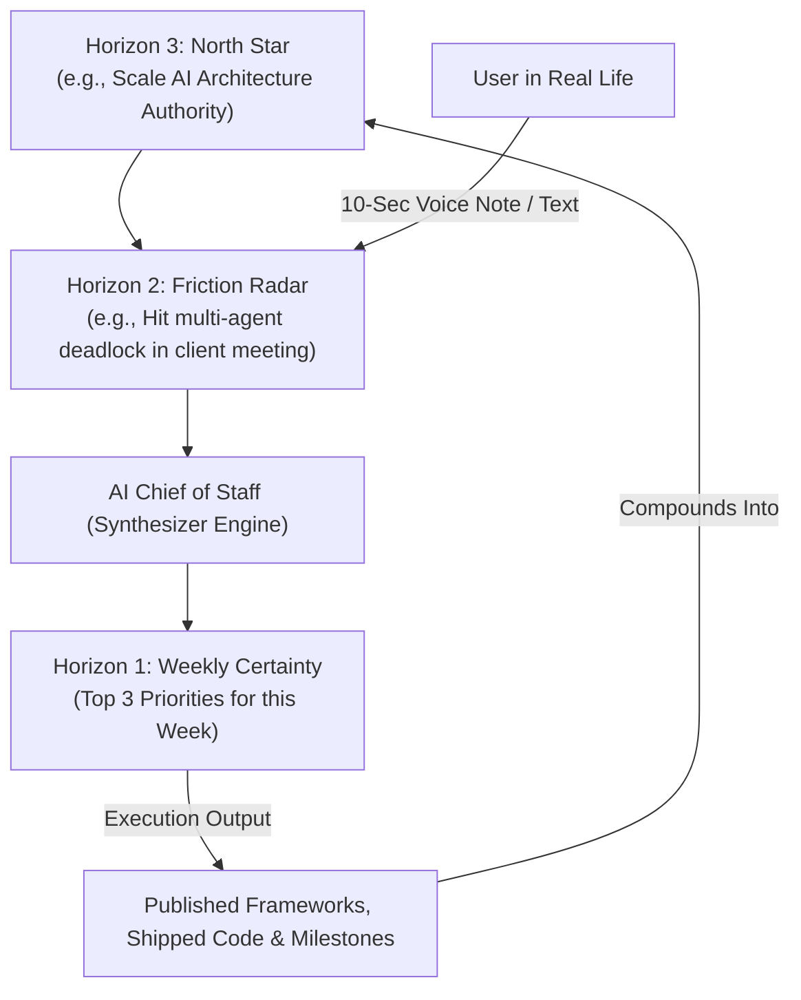

# The 3-Horizon Life Engine

> **The Invariant**: Traditional goal tracking fails because it lacks a feedback bridge between long-term vision and daily execution. The 3-Horizon Life Engine creates an unbreakable pipeline: **North Star Vision Real-Time Mobile Friction Weekly Certainty Execution**.

---

```
HORIZON 3: NORTH STAR
(3-5 Long-Term Life Milestones)


HORIZON 2: FRICTION RADAR
(Real-Time Voice/Text Capture via Telegram)


HORIZON 1: WEEKLY CERTAINTY
(3 Non-Negotiable Priorities Every Monday)
```

---

## The Three Horizons Explained

### 1. Horizon 3: North Star (Long-Term Vision)
* **Time Horizon**: 1 to 3 Years.
* **Scope**: 3 to 5 permanent, non-negotiable life milestones (e.g., Deliver a Tier-1 Keynote Talk, Scale an AI Product to $100k ARR, Achieve Peak Physical Vitality).
* **Core Question**: *What is the singular milestone that makes everything else easier or unnecessary?*

### 2. Horizon 2: Friction Radar (Real-Time Capture)
* **Time Horizon**: Continuous / Real-Time.
* **Scope**: The moments where life collides with your plans. Captured instantly via 10-second voice notes or text on Telegram while in transit, after meetings, or late at night.
* **Core Question**: *Where did reality push back against my assumptions today?*

### 3. Horizon 1: Weekly Certainty (Deterministic Execution)
* **Time Horizon**: 7-Day Sprints.
* **Scope**: Every Sunday evening or Monday morning, the AI Chief of Staff evaluates all friction captured during the week and distills it into **3 non-negotiable execution priorities**.
* **Core Question**: *What 3 concrete moves must be completed before Friday?*

---

## Operating Flow in Practice



---

## Comparing the Two Models

| Dimension | Model A: The 4-Quadrant Compass | Model B: The 3-Horizon Engine |
| :--- | :--- | :--- |
| **Best For** | Holistic life balance across multiple domains | Aggressive, laser-focused goal execution |
| **Pillars** | Mission, Mastery, Money, Mind | Horizon 3 (Vision), Horizon 2 (Friction), Horizon 1 (Sprint) |
| **Cadence** | Daily balance checks & energy audits | Weekly sprint cycles with real-time obstacle logging |
| **Primary Metric** | Quadrant equilibrium & cognitive clarity | Milestone completion rate & compounding scars |
