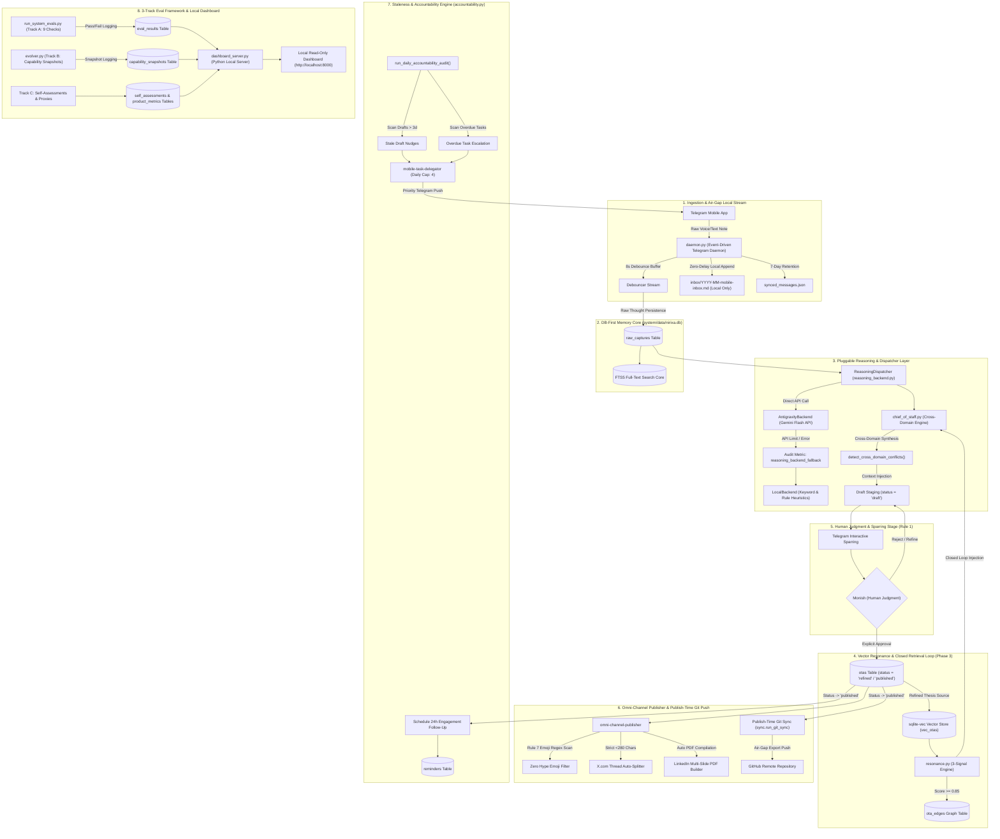

# My-OS v0.2 - Master Architecture Diagram (Refined & Verified)

**Purpose**: High-density architectural diagram formatted in GFM Mermaid syntax for structural review, capability auditing, and feedback by external LLMs (Claude 3.5 Sonnet / Claude Opus).

---

## Complete End-to-End System Architecture

---

## Key Architecture Clarifications

1. **Strict Air-Gap Boundary**: Mobile Telegram raw notes append locally to `inbox/YYYY-MM-mobile-inbox.md`. No auto `git push` occurs on raw capture ingestion. `git commit & push` fires **strictly when an OTA is published**, keeping unsanitized thoughts local.
2. **Refined-Thesis Vector Store**: `vec_otas` is populated **strictly from clean `otas.refined_thesis`** statements, matching refined concepts against each other for Thought Resonance.
3. **Closed Retrieval Loop**: `resonance.get_injected_sparring_context(query_text)` is directly embedded into `chief_of_staff.get_cross_domain_context()`, resurfacing top-K resonant past OTAs into active Telegram sparring prompts.
4. **Programmatic Quality Gates**: `docs/STANDARDS.md` is Monish's human calibration guide. Automated checks in `omni-channel-publisher` gate on testable regex rules (zero hype emojis, 280-char X split).
5. **Direct API Reasoning**: `AntigravityBackend` uses direct Gemini API endpoints for low-latency thesis generation with `reasoning_backend_fallback` metric auditing.
