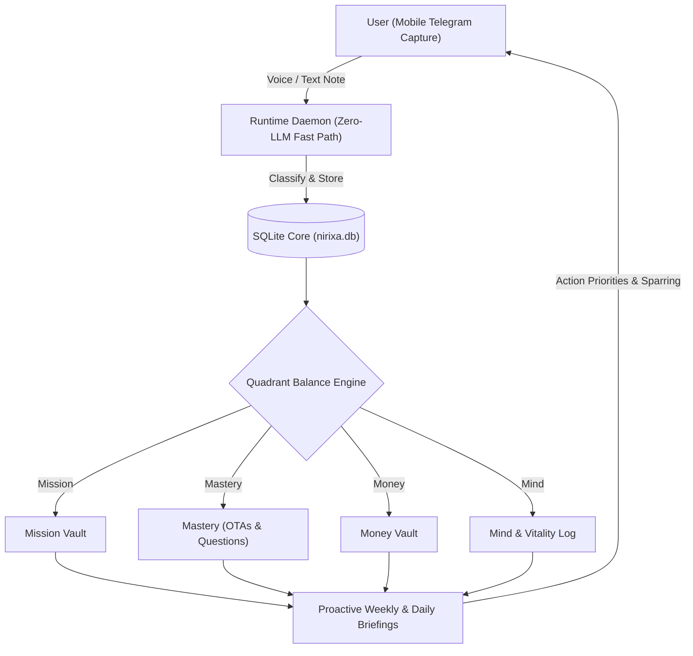

# The Personal Operating Compass

> **The Invariant**: Traditional productivity apps fail because they manage tasks in isolation. The Personal Operating Compass organizes your life, thinking, and AI co-founder around the four core drivers of human momentum: **Mission, Mastery, Money, and Mind**.

---

```
MISSION
(Career, Products, Outputs)


MIND MASTERY
(Health, Clarity, Energy) (Deep Inquiry, Knowledge)


MONEY
(Freedom, Capital, Equity)
```

---

## The Four Life Quadrants

### 1. Mission (Creation & Impact)
* **Definition**: The work you ship to the world.
* **Scope**: Career leaps, consulting client outcomes, multi-agent systems, product building, and public authority assets.
* **Core Question**: *What tangible proof-of-work did I create or unblock today?*

### 2. Mastery (Inquiry & Depth)
* **Definition**: The compounding engine of your mind.
* **Scope**: Deep research papers, book synthesis, foundational inquiries, mental models, and Original Thought Assets (OTAs).
* **Core Question**: *What fundamental question or mental model did I refine today?*

### 3. Money (Capital & Freedom)
* **Definition**: Financial leverage and sovereignty.
* **Scope**: Revenue streams, equity positions, investments, savings milestones, and asset growth.
* **Core Question**: *Did today's decisions increase my long-term asymmetric upside?*

### 4. Mind (Clarity & Vitality)
* **Definition**: The biological foundation that powers all other quadrants.
* **Scope**: Physical health, workouts, sleep quality, evening rides/walks, mental recovery, and philosophical stillness.
* **Core Question**: *Is my energy battery primed to sustain high-leverage thinking?*

---

## How the AI Operating System Interacts with the Compass



### The Operating Loop in Practice
1. **Zero-Friction Mobile Capture**: When friction or insight occurs, send a 10-second voice note or text to Telegram.
2. **Deterministic Auto-Classification**: The engine maps the capture into the relevant quadrant without manual folder sorting.
3. **Socratic Sparring**: For deep ideas (Mastery) or system blockers (Mission), the AI challenges assumptions and refines the thesis.
4. **Weekly Balance Audit**: The AI evaluates your quadrant distribution:
* *Example*: *"You logged 14 items in Mission this week, but Mind and Mastery had 0 logs. Schedule a 45-minute reflection session before Monday."*
