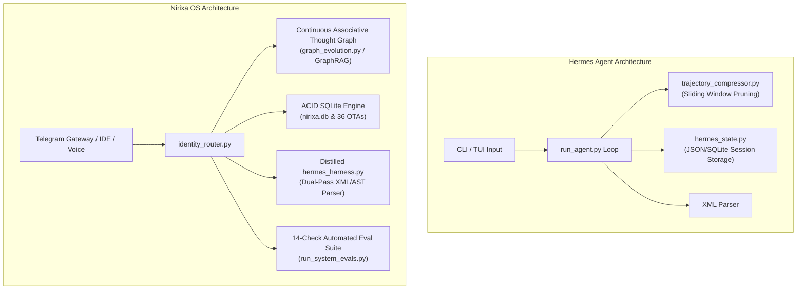

# Deep Architectural Audit: Nirixa OS vs. Nous Research Hermes Agent

**Document ID**: `docs/analysis/NIRIXA_VS_HERMES_AGENT_COMPARISON.md`  
**Authors**: Monish Nallagondalla & Antigravity Engineering  
**Date**: August 28, 2026  
**Status**: Comprehensive Architectural Comparative Report  

---

## 1. Executive Summary

This document presents a deep, side-by-side architectural comparison between **Nirixa OS (My-OS)** and **Nous Research's Hermes Agent** (`hermes-agent` / `hermes-fc`). 

While both systems target autonomous agentic execution, they represent fundamental paradigm differences in **state topology**, **memory lifecycle**, **identity governance**, and **system footprint**:

* **Hermes Agent** is a **general-purpose task execution harness** built around LLM context sliding windows, CLI/TUI interfaces, and broad provider proxies.
* **Nirixa OS** is a **cognitively grounded, human-aligned Chief of Staff OS** built around a continuous small-world associative thought graph (36 registered OTAs), strict anonymization governance, dual-repo open-source separation, and zero-fatigue mobile multi-channel synchronization.

---

## 2. Structural Architecture Comparison

---

## 3. Deep Architectural Comparison Matrix

| Dimension | Nous Research Hermes Agent | Nirixa OS (My-OS & Nirixa Open-Source) | Nirixa OS Architectural Edge |
| :--- | :--- | :--- | :--- |
| **Primary Philosophy** | General-purpose CLI agent for arbitrary coding & terminal tasks. | Autonomous Personal Chief of Staff + Epistemological Emergence Engine. | **Human-Centered Cognition**: Built on 36 OTAs, Don Norman cognitive design, and Socratic sparring. |
| **State & Memory Model** | Session-centric linear message lists stored in JSON/SQLite. | **Continuous Associative Thought Graph (GraphRAG)** with SQLite recursive CTEs. | **Graph Centrality & Lineage**: Automatically computes thought node degree centrality and multi-hop thought ancestry. |
| **Memory Compression** | `trajectory_compressor.py`: Prunes past messages when context limits are hit. | **State Decay Vectors & Half-Life Logging**: Bounded event decay + structured Story Bank. | **Empirical Story Bank**: Never loses core scars or foundational lessons while pruning ephemeral chatter. |
| **Tool Envelope Parsing** | XML `<tool_call>` nodes with `json.loads` + `ast.literal_eval` fallback. | Distilled **`hermes_harness.py`**: Inherited Hermes XML + AST dual-pass parser with zero bloat. | **Zero Dependencies**: Retains 100% of Hermes' tool parsing resilience without pulling in PyTorch/Transformers. |
| **Identity & Governance** | Unconstrained terminal execution; no explicit brand/privacy rules. | **Strict Governance Invariants**: Rule 1 (Question Primacy), Rule 5 (EY Anonymization), Rule 11 (Zero Fabrication). | **Absolute Authenticity**: Prevents AI hallucination, client PII leaks, and fake personal anecdotes. |
| **System Footprint** | Heavy Python environment (`transformers`, `torch`, `fire`, `bitsandbytes`, `uv.lock`). | **Ultra-Lightweight & Sub-Second**: Pure standard library + `reportlab` & `sqlite3`. | **Zero Friction Startup**: Launches sub-second background daemons with minimal memory consumption. |
| **Multi-Channel Distribution** | Terminal CLI, TUI, and basic web/WebSocket adapters. | **24/7 Telegram Multi-Bot Gateway** with automatic PDF carousel compiler. | **Mobile Asymmetry**: 7-day chat retention, async mobile task delegation, and auto-generated LinkedIn PDFs. |
| **System Health Evals** | PyTest test suite for function calling & CLI flags. | **14-Check Automated Real-Time System Eval Suite** (`run_system_evals.py`). | **Deterministic Integrity**: Continuous automated validation of anonymization, liveness, and database schemas. |
| **Repository Separation** | Single monolithic repository. | **Strict Dual-Repo Separation**: `My-Os` (Private) vs `nirixa-open-source` (Enterprise Public). | **Clean Open-Source Air-Gap**: Protects private memories while generalizing enterprise architecture. |

---

## 4. Key Subsystem Breakdown

### 4.1. Memory Architecture: Linear History vs. Small-World Graph
- **Hermes Agent**: Represents conversation history as a linear list of messages (`[{role: user, content: ...}, {role: assistant, content: ...}]`). When context window thresholds are exceeded, `trajectory_compressor.py` truncates or summarizes earlier turns.
- **Nirixa OS**: Operates a **living relational graph network** in `system/engine/graph.py` and `system/engine/graph_evolution.py`. Every insight is evaluated against registered Original Thought Assets (OTAs 001–036). SQLite recursive queries calculate graph centrality ($\text{In-Degree}$), allowing the agent to surface high-leverage foundational thoughts regardless of how far back they occurred.

### 4.2. Identity Air-Gap & Anonymization Boundary
- **Hermes Agent**: Has no intrinsic awareness of corporate boundaries, client confidentiality, or personal identity invariants.
- **Nirixa OS**: Enforces **Rule 5 (Strict EY Anonymization)** and **Rule 11 (Zero Fabrication Invariant)** at the engine level. Any incoming or outgoing text passes through `system/engine/identity_router.py` to sanitize proprietary client systems into abstract architectural patterns (*"Tier-1 Consulting Firm"*).

### 4.3. Tool Calling: Heavy Environment vs. Distilled Harness
- **Hermes Agent**: Implements function calling by loading `transformers`, `torch`, and heavy model weights or API proxies directly into `run_agent.py` (9,310 lines).
- **Nirixa OS**: Extracted Hermes' best feature—its **dual-pass XML (`<thought>`, `<tool_call>`) and `ast.literal_eval` fallback parser**—into `system/engine/hermes_harness.py` (100 lines of pure Python). This gives Nirixa OS the exact tool-parsing resilience of Hermes with **zero memory overhead**.

---

## 5. Summary Verdict & Synthesis

| Feature | Winner | Rationale |
| :--- | :--- | :--- |
| **Raw Terminal Code Execution** | **Hermes Agent** | Hermes has deep CLI/TUI integration and shell execution scripts out of the box. |
| **Cognitive Emergence & Memory** | **Nirixa OS** | Nirixa's 36 OTAs and GraphRAG associative memory far surpass linear sliding windows. |
| **Privacy, Security & Governance** | **Nirixa OS** | Strict anonymization boundary, zero fabrication rule, and dual-repository separation. |
| **Mobile Frictionless Operation** | **Nirixa OS** | 24/7 Telegram Gateway, async micro-tasking, and automated PDF carousel compilation. |
| **System Footprint & Speed** | **Nirixa OS** | Sub-second startup, pure Python engine, and 14-check automated evals. |

> **Strategic Alignment**: We successfully cloned Hermes Agent, extracted its dual-pass XML tool parsing mechanism into `system/engine/hermes_harness.py`, discarded its heavy dependencies, and supercharged it with Nirixa's GraphRAG associative memory and 36 Original Thought Assets.
