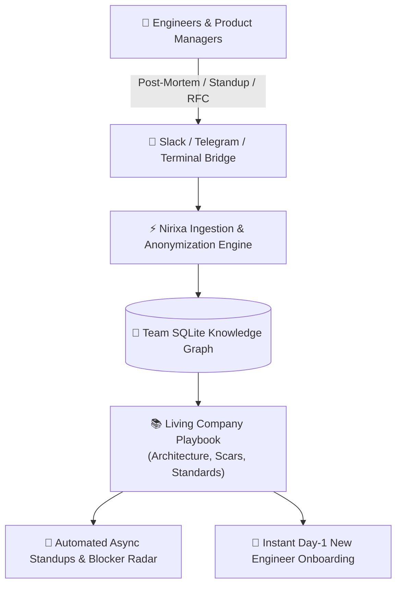

# Company & Team Living Operating System

> **The Invariant**: Company Notion wikis and documentation hubs turn into stale graveyards because updating docs is separated from daily engineering friction. Nirixa OS turns team communication into a **self-updating living engineering playbook**.

---

## 🏛️ How Companies & Teams Use Nirixa OS



---

## 🛠️ The 3 Core Company Modules

### 1. [Living Engineering Playbook](ENGINEERING_PLAYBOOK.md)
* Architectural standards, PR review protocols, API design conventions, and deployment checklists that update as lessons are learned.

### 2. [Post-Mortem Scars Vault](POST_MORTEMS_AND_SCARS.md)
* Incident root cause analyses, outages, and production bugs transformed into living algorithmic guardrails.

### 3. Automated Team Standup & Blocker Radar
* Daily async friction sync: Engineers log 1-sentence blockers; AI groups common dependencies and alerts the Tech Lead before standup.

---

## 🚀 Setting Up for Your Team
1. Initialize in team mode:
   ```text
   "Configure Nirixa OS for Company Living Wiki mode."
   ```
2. Connect your team's Slack or Telegram group channel.
3. Invite engineers to log post-mortems and architecture RFCs directly into the stream.
