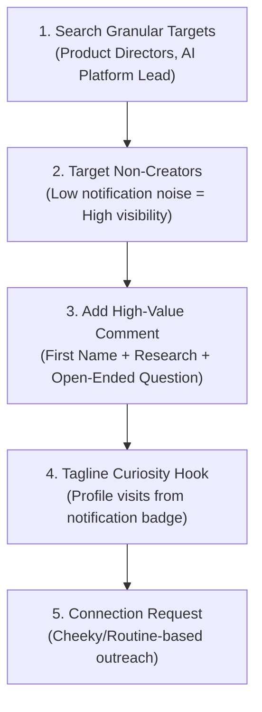

# Basha LinkedIn Networking & Content Growth Strategy

[Documentation](../README.md) / [Guides](LEADER_BLUEPRINT.md) / [Basha LinkedIn Strategy](BASHA_LINKEDIN_STRATEGY_SUMMARY.md)

**Extracted from YouTube Video (`TO3KhNfxvnA` at t=4669s) & Monish's Core OTAs (OTA-016, OTA-017, OTA-018).**

---

## 🎯 Core Philosophy & Principles

1. **Relevance & Utility > Performative Likes (OTA-016)**:
   - Likes are vanity metrics; **shares and deep comments dictate real distribution**.
   - Shares happen when content has undeniable utility and high relevance to a reader's day-to-day job.

2. **The Reliability Advantage (OTA-017)**:
   - Being reliable and consistent is far more advantageous than showing off isolated brilliance.
   - People trust partners, engineers, and leaders who consistently execute and share high-signal value.

3. **Narrative & Story Density (OTA-018)**:
   - Pure facts alone don't spread. Human stories, empirical scars, and structured narrative arcs create emotional resonance.

---

## 🔍 The Basha High-Relevance Engagement Protocol

### 1. Target Non-Creators for 10x Visibility
* **Why**: Famous content creators receive 50+ notifications an hour and rarely read comments. Product directors and engineering managers who post infrequently notice **every single comment**.
* **How**: Search LinkedIn using granular keywords (e.g., `AI Developer Platform`, `Product Director`, `APIs`).

### 2. High-Value Comment Blueprint
* **Address by First Name**: Drop the last name for warmth (`Hey Marco, ...`).
* **Add Substantive Research**: Share 2-3 sentences proving you read their post or analyzed their problem.
* **End with an Open-Ended Question**: Invites natural back-and-forth dialogue.

### 3. The Tagline Curiosity Engine
* When you comment, the recipient gets a notification: `[Your Name] [Your Tagline] commented on your post`.
* If your tagline is razor-sharp (e.g., *Principal AI Architect | Building Multi-Agent Systems*), they naturally click to inspect your profile.

### 4. Connection Outreach Mechanics
* **Appeal to Routine**: *"Since you already eat 3 meals a day, let me buy your lunch for 15 mins of your brain power."*
* **Direct Reference**: Mention a specific job application, project scar, or shared interest.
