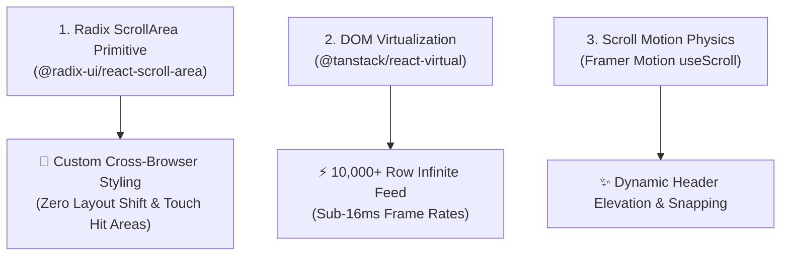

# Engineering Guide: shadcn/ui Scroll Architecture & High-Performance Scrolling

**Author**: Monish Nallagondalla
**Subsystem**: Web App Engineering & Design Systems
**Target Stack**: Next.js, React, Radix UI, Framer Motion, Tailwind CSS

---

## 1. Executive Summary

In modern web applications, scroll experience is a critical driver of perceived performance and user engagement. Default browser scrollbars often cause layout shifts, inconsistent mobile touch behaviors, and poor aesthetics. 

**shadcn/ui Scroll Engineering** solves these challenges by combining **Radix UI primitives**, **DOM virtualization**, and **scroll-linked physics animations**.

---

## 2. Core Architecture Pillars



---

## 3. Pillar 1: Radix UI Custom ScrollArea (`scroll-area.tsx`)

The `ScrollArea` component in shadcn/ui wraps `@radix-ui/react-scroll-area` to provide consistent, cross-platform scrollbars without modifying body layout flow.

### Implementation Pattern (`components/ui/scroll-area.tsx`)

```tsx
"use client";

import * as React from "react";
import * as ScrollAreaPrimitive from "@radix-ui/react-scroll-area";
import { cn } from "@/lib/utils";

const ScrollArea = React.forwardRef<
  React.ElementRef<typeof ScrollAreaPrimitive.Root>,
  React.ComponentPropsWithoutRef<typeof ScrollAreaPrimitive.Root>
>(({ className, children, ...props }, ref) => (
  <ScrollAreaPrimitive.Root
    ref={ref}
    className={cn("relative overflow-hidden", className)}
    {...props}
  >
    <ScrollAreaPrimitive.Viewport className="h-full w-full rounded-[inherit]">
      {children}
    </ScrollAreaPrimitive.Viewport>
    <ScrollBar />
    <ScrollAreaPrimitive.Corner />
  </ScrollAreaPrimitive.Root>
));
ScrollArea.displayName = ScrollAreaPrimitive.Root.displayName;

const ScrollBar = React.forwardRef<
  React.ElementRef<typeof ScrollAreaPrimitive.Scrollbar>,
  React.ComponentPropsWithoutRef<typeof ScrollAreaPrimitive.Scrollbar>
>(({ className, orientation = "vertical", ...props }, ref) => (
  <ScrollAreaPrimitive.Scrollbar
    ref={ref}
    orientation={orientation}
    className={cn(
      "flex touch-none select-none transition-colors",
      orientation === "vertical" &&
        "h-full w-2.5 border-l border-l-transparent p-[1px]",
      orientation === "horizontal" &&
        "h-2.5 flex-col border-t border-t-transparent p-[1px]",
      className
    )}
    {...props}
  >
    <ScrollAreaPrimitive.Thumb className="relative flex-1 rounded-full bg-slate-700 hover:bg-slate-500 transition-colors" />
  </ScrollAreaPrimitive.Scrollbar>
));
ScrollBar.displayName = ScrollAreaPrimitive.Scrollbar.displayName;

export { ScrollArea, ScrollBar };
```

---

## 4. Pillar 2: High-Performance Virtualization (`@tanstack/react-virtual`)

When rendering long lists (e.g., chat histories, transaction logs, activity feeds), rendering all DOM nodes causes memory bloat and scroll stutter. 

Virtualization renders **only items currently inside the visible viewport + a small buffer**.

```tsx
import { useVirtualizer } from "@tanstack/react-virtual";

export function VirtualizedFeed({ items }: { items: string[] }) {
  const parentRef = React.useRef<HTMLDivElement>(null);

  const rowVirtualizer = useVirtualizer({
    count: items.length,
    getScrollElement: () => parentRef.current,
    estimateSize: () => 64, // Estimated height per row
    overscan: 5,            # Render 5 extra rows above/below viewport
  });

  return (
    <div ref={parentRef} className="h-[500px] overflow-auto">
      <div
        className="relative w-full"
        style={{ height: `${rowVirtualizer.getTotalSize()}px` }}
      >
        {rowVirtualizer.getVirtualItems().map((virtualRow) => (
          <div
            key={virtualRow.index}
            className="absolute top-0 left-0 w-full"
            style={{
              height: `${virtualRow.size}px`,
              transform: `translateY(${virtualRow.start}px)`,
            }}
          >
            {items[virtualRow.index]}
          </div>
        ))}
      </div>
    </div>
  );
}
```

---

## 5. Pillar 3: Framer Motion Scroll Physics & Dynamic Elevation

For premium design aesthetics, scroll events trigger dynamic header elevation, backdrop blurring, and progress indicators.

```tsx
"use client";

import { motion, useScroll, useTransform } from "framer-motion";

export function ScrollHeader() {
  const { scrollY } = useScroll();
  
  // Transform scroll position into backdrop blur and opacity
  const headerBackground = useTransform(
    scrollY,
    [0, 50],
    ["rgba(13, 17, 23, 0)", "rgba(13, 17, 23, 0.85)"]
  );
  
  const borderOpacity = useTransform(scrollY, [0, 50], [0, 1]);

  return (
    <motion.header
      style={{ backgroundColor: headerBackground }}
      className="sticky top-0 z-50 backdrop-blur-md transition-all duration-200 border-b border-slate-800/50"
    >
      <div className="max-w-7xl mx-auto px-6 py-4 flex items-center justify-between">
        <h1 className="text-lg font-bold text-slate-100">Nirixa OS</h1>
      </div>
    </motion.header>
  );
}
```

---

## 6. Summary Checklist for Engineering Team

- [x] **Zero Layout Shift**: Use `ScrollAreaPrimitive.Viewport` with hidden native scrollbars (`scrollbar-width: none`).
- [x] **Virtualization**: Wrap lists over 100 items with `@tanstack/react-virtual`.
- [x] **Touch Optimization**: Ensure scrollbars have `touch-none` and thumb hit areas expand on hover/touch.
- [x] **Performance Budget**: Target constant 60 FPS scrolling by keeping scroll handlers off the main thread (using CSS transitions or `requestAnimationFrame`).
