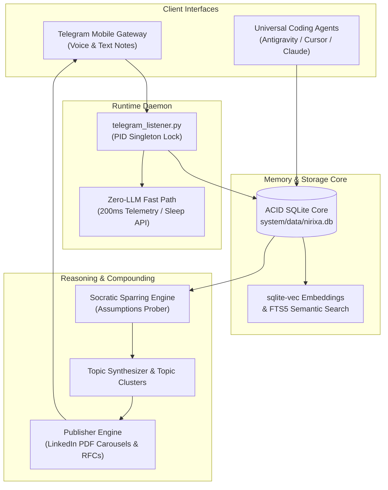

# System Architecture & Technical Specifications

[Documentation](../README.md) / [Reference](ARCHITECTURE.md) / [System Architecture](ARCHITECTURE.md)

**A first-principles breakdown of Nirixa OS: ACID SQLite Memory Core, Zero-LLM Fast Path, and Socratic Compounding Engine.**

---

## 1. High-Level Architecture Diagram

---

## 2. Core Subsystems

### A. Zero-LLM Fast Path (100% Deterministic at $0 Token Cost)
* Hardware telemetry (CPU, RAM, Disk, DB count) is collected locally via Python standard library and dispatched via Telegram API in <200ms.
* Windows Suspend API (`SetSuspendState`) is executed directly via PowerShell without LLM invocation.
* Reminders regex matching and time-wheel events run in pure Python.

### B. Single Source of Truth: ACID SQLite Core (`nirixa.db`)
* **Tables**:
* `captures`: Raw and anonymized mobile voice/text captures with timestamp and source.
* `topics`: Dynamically clustered high-level conceptual themes.
* `reminders`: Time-indexed scheduled notifications.
* `eval_logs`: Unit test and feedback audit scores.
* **Integrity**: Zero unorganized flat markdown sprawl; structured relational ACID guarantees.

### C. Proactive Socratic Sparring Engine
* Unlike typical assistants that autocomplete or flatter, the Socratic engine identifies unstated premises, tests edge cases, and links insights to the 15 Core OTAs (`OTA-001` through `OTA-015`).
