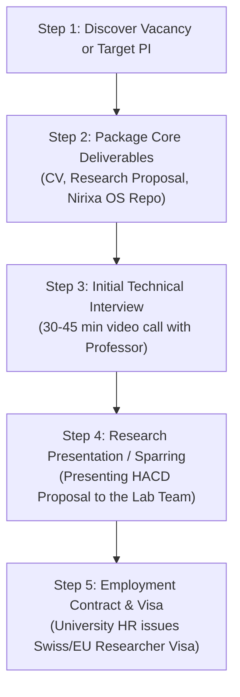

# 🌐 Open PhD Positions: Direct Portals & Complete Application Process

**Target**: Salaried European Doctoral Researcher Employment (Switzerland, Germany, Netherlands, Nordics, MSCA Networks)

---

## 🔗 1. Official Direct Links to Check Open Positions

In Europe, funded PhDs are posted as **paid research jobs**. Here are the primary official job boards:

### 🇪🇺 Pan-European Centralized Portals (Highest Volume)
* **EURAXESS (European Commission Official Job Board)**:  
  👉 [https://euraxess.ec.europa.eu/jobs/search](https://euraxess.ec.europa.eu/jobs/search)  
  *(Filter: Research Field = "Computer Science" / "Cognitive Science", Profile = "First Stage Researcher (R1)")*
* **ELLIS PhD & Postdoc Program (Pan-European AI Excellence Network)**:  
  👉 [https://ellis.eu/phd-postdoc](https://ellis.eu/phd-postdoc)  
  *(Annual centralized call across top AI labs in Zurich, Munich, Lisbon, Amsterdam, Oxford)*
* **FindAPhD (Europe Funded Positions)**:  
  👉 [https://www.findaphd.com/phds/europe/](https://www.findaphd.com/phds/europe/)  
  *(Filter: "Funded PhD Projects", Country = Switzerland / Germany / Netherlands / Finland)*

---

### 🏛️ University-Specific Direct Job Boards

* **🇨🇭 University of Zurich (UZH Job Portal)**:  
  👉 [https://jobs.uzh.ch](https://jobs.uzh.ch)  
  *(Search keywords: "Informatics", "HISE", "Human-Centered AI", "Doktorand / PhD")*
* **🇨🇭 ETH Zurich Official Job Board**:  
  👉 [https://jobs.ethz.ch](https://jobs.ethz.ch)  
  *(Search category: "PhD & Academic Positions" in Department of Computer Science)*
* **🇩🇪 Technical University of Munich (TUM Job Portal)**:  
  👉 [https://portal.mytum.de/jobs/wissenschaftler](https://portal.mytum.de/jobs/wissenschaftler)  
  *(Look for TV-L E13 "Wissenschaftliche/r Mitarbeiter/in / PhD Position" in HCI & Informatics)*
* **🇳🇱 AcademicTransfer (All Netherlands Universities - Utrecht, TU Eindhoven, Leiden)**:  
  👉 [https://www.academictransfer.com/en/](https://www.academictransfer.com/en/)  
  *(The single official clearinghouse for all Dutch salaried PhD positions)*
* **🇫🇮 University of Oulu Open Vacancies (Hybrid Intelligence)**:  
  👉 [https://www.oulu.fi/en/open-jobs](https://www.oulu.fi/en/open-jobs)  
  *(Search for "Doctoral Researcher" positions in the Hybrid Intelligence HI Programme)*

---

## 📋 2. The European Application Process (Step-by-Step)

Unlike US universities that use generic graduate admissions committees with standard GRE tests, European PhDs follow **The Employment Model**. You are being hired as a **salaried staff researcher**.

There are two primary pathways to apply:

```
┌────────────────────────────────────────────────────────┬────────────────────────────────────────────────────────┐
│ PATHWAY A: Applied to an Advertised Vacancy (Job Route)│ PATHWAY B: Direct Professor Outreach (Pre-Proposal)    │
├────────────────────────────────────────────────────────┼────────────────────────────────────────────────────────┤
│ • A professor has existing grant money (SNSF / Horizon)│ • You approach a professor whose lab you admire.       │
│ • Vacancy posted on EURAXESS or university job portal. │ • You send a high-signal 3-sentence note + proposal.   │
│ • Fixed application deadline (2–4 weeks).              │ • If interested, PI allocates budget or co-applies.    │
└────────────────────────────────────────────────────────┴────────────────────────────────────────────────────────┘
```

---

### 🛠️ The 5 Steps of the Application Lifecycle



---

### Step 1: Prepare Your 4 Core Application Artifacts

1. **Academic CV (2 Pages, European/Swiss NSF Standard)**:
   * Header: Monish Nallagondalla — Data Science, Agent Architecture & Cognitive Systems.
   * Section 1: Education (Master's / Bachelor's degrees with ECTS details).
   * Section 2: Technical & Systems Stack (Python, PyTorch, SQLite GraphRAG, Multi-Agent Systems).
   * Section 3: Enterprise & Leadership Scars (Tier-1 Consulting / EY delivery).
   * Section 4: Open-Source Research Artifacts ([`Nirixa OS GitHub Repo`](https://github.com/Monish-Nallagondalla/Nirixa)).
2. **5-to-8-Page Research Proposal**:
   * Derived directly from [`phd/PHD_RESEARCH_DIRECTION.md`](file:///c:/Users/MONISH/OneDrive/Documents/My-Os/phd/PHD_RESEARCH_DIRECTION.md) (Title, 4 Pillars, RQ1–RQ8, NASA-TLX psychometrics, and mixed-effects ANOVA).
3. **Motivation / Cover Letter (1 Page)**:
   * Why this specific lab (e.g. citing Prof. Gerhard Schwabe's 2025 paper).
   * Why your profile bridges the gap between enterprise product reality and cognitive science.
4. **2–3 References**:
   * Names and institutional emails of 1 academic professor + 1–2 senior consulting/industry leaders.

---

### Step 2: The High-Signal Direct Outreach Formula (For Pathway B)

When reaching out to professors (e.g. at UZH, TUM, or Oulu), **never** send a generic copy-pasted email. Use this 3-paragraph structure:

> **Subject**: Doctoral Research Inquiry: Human–Agent-Centred Product Design & Nirixa OS — Monish Nallagondalla
>
> *Dear Prof. [Last Name],*
>
> *I have been following your lab's work on [Specific Topic / Paper Title, e.g., AI-augmented collaboration], particularly your findings on [1 specific insight from their 2025 paper].*
>
> *My research focuses on **Human–Agent-Centred Product Design (HACD)**—investigating how products, cognitive offloading, and human reasoning coevolve when AI agents act as active operators. To study this longitudinally, I have built **Nirixa OS** (open-source on GitHub), an instrumented cognitive partner logging real-time interaction telemetry and GraphRAG states.*
>
> *I am writing to inquire if you have open salaried doctoral researcher positions (SNSF/Horizon Europe) in your group for the 2026/2027 intake. I have attached my 2-page CV and research proposal for your review, and would welcome a brief 15-minute conversation if this aligns with your lab's current direction.*
>
> *Sincerely,*  
> *Monish Nallagondalla*

---

### Step 3: The Interview & Lab Presentation
* **Round 1 (30 mins with PI)**: Discussion of your background, why you want to do a PhD, and your understanding of the lab's papers.
* **Round 2 (45 mins with the Lab Group)**: You present a 15-minute slide deck on your research proposal and demo `Nirixa OS` running live.

---

### Step 4: Contract Signing & Visa Issuance
* Upon acceptance, the University HR issues a **Salaried Employment Contract** (e.g., Swiss SNSF Assistant contract or German TV-L E13).
* The university directly submits your hosting agreement to the immigration authority (Cantonal Migration Office in Switzerland or Ausländerbehörde in Germany).
* You and your wife receive your **Long-Stay D-Visa / Residence Permit with full right to work**.
